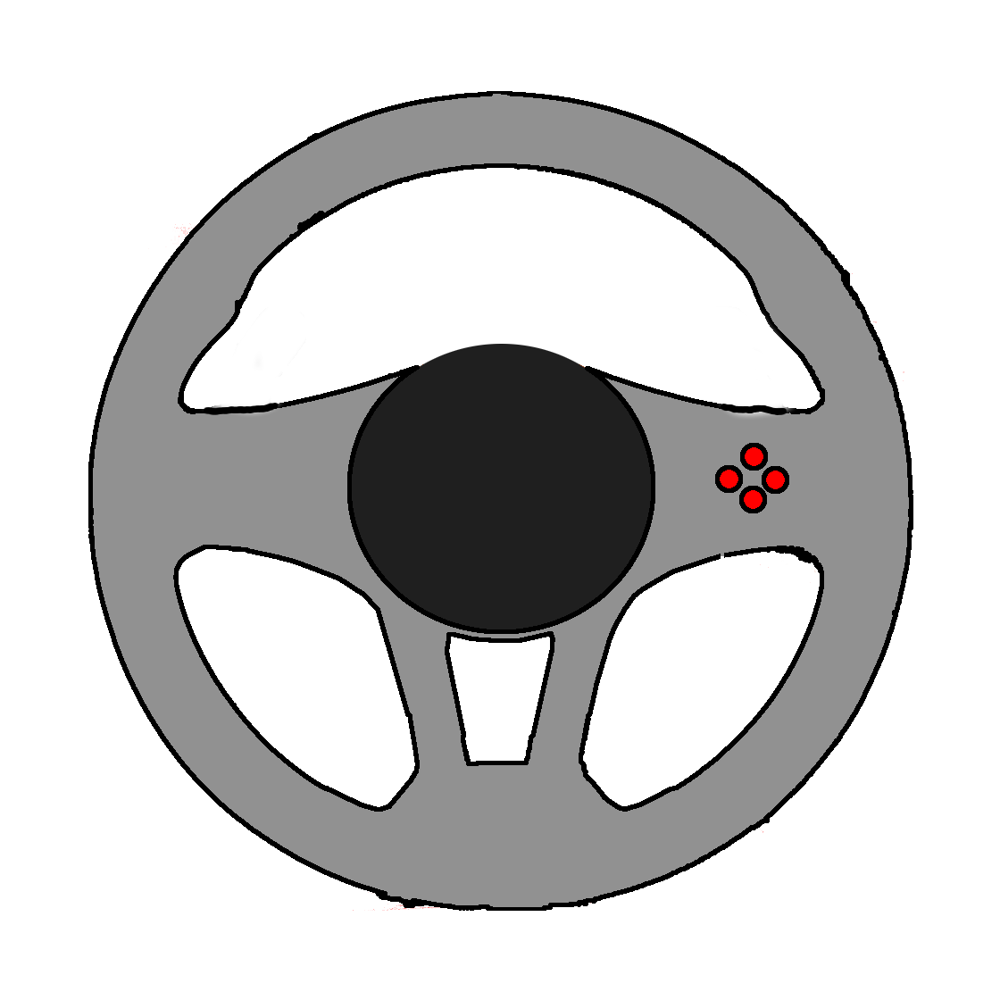
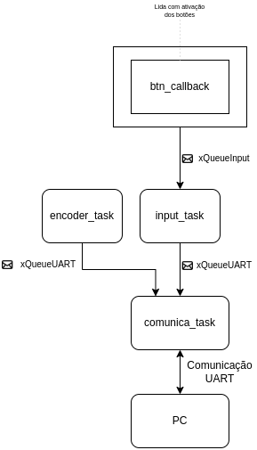

# Volante para Euro Truck Simulator

## Descrição do Projeto

Este projeto consiste no desenvolvimento de um controle customizado em formato de volante para o jogo **Euro Truck Simulator**.

## Jogo

[Euro Truck Simulator 2](https://eurotrucksimulator2.com/) é um simulador de caminhão desenvolvido pela SCS Software que permite aos jogadores dirigir caminhões por uma representação da Europa, entregando cargas de uma cidade para outra. O jogo simula com precisão a direção de caminhões reais, incluindo câmbio manual, limitações de velocidade, consumo de combustível e regulamentos de trânsito.

## Ideia do Controle

Nosso controle é um volante de caminhão em escala reduzida mas com elementos realistas, incluindo:

- Volante com rotação de 900 graus (2.5 voltas completas)
- Pedais analógicos (acelerador, freio e embreagem)
- Botões para funções essenciais como luzes, buzina, freio de mão, etc.

## Inputs e Outputs

### Inputs (Sensores)

1. **Entradas Analógicas:**
   - **2x potenciômetros rotativos** para detectar a rotação do volante e a pressão no pedal do acelerador/freio.

2. **Entradas Digitais:**
   - Botões para troca de marcha
   - Botão para o freio de mão
   - Botão para ligar e desligar o caminhão
   - Botão de buzina
   - Botão de luzes

### Outputs (Atuadores)

1. **Feedback Visual:**
   - Display OLED pequeno para informações do jogo (velocidade, marcha atual)

### Outros componentes:
   - Botão de liga/desliga (status do controle)
   - LED para indicar status de conexão com o computador

## Protocolo de Comunicação

O volante se comunica com o computador através de **USB** ou **Bluetooth**, utilizando um protocolo simples baseado em pacotes de dados que enviam as informações dos sensores e botões em tempo real. As entradas operam via **interrupções**, garantindo baixa latência e resposta rápida.

## Diagrama de Blocos do Firmware

## Imagens do Projeto

### Design Proposto
!!!

### Protótipo Real
!!!

### Detalhes Internos
!!!

## Links Úteis

- !!!

---
### Equipe de Desenvolvimento
- **Henrique Leite dos Santos**
- **Pedro Henrique Viegas Ribeiro**